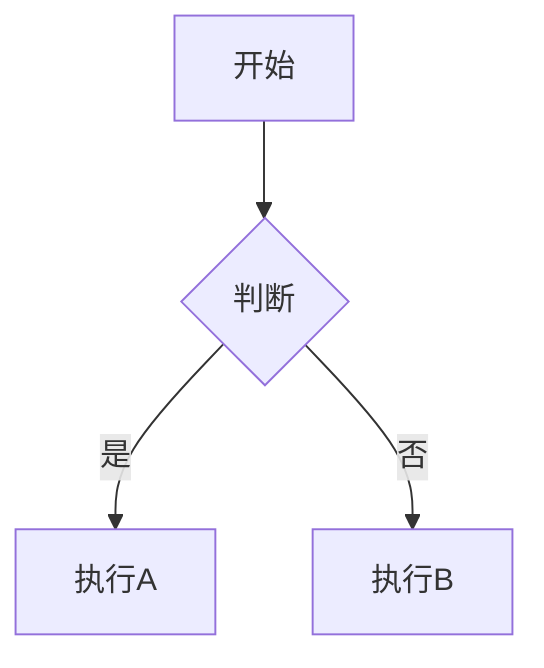
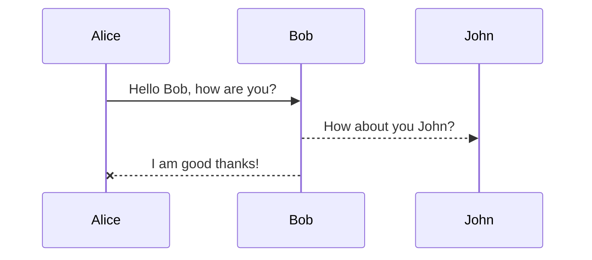
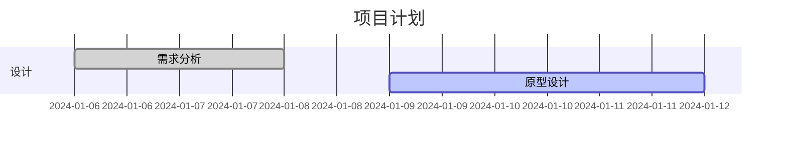

欢迎来到我的博客！

- 个人主页: [https://sherlocknieh.github.io/HOME](https://sherlocknieh.github.io/HOME)

- 简历: [https://sherlocknieh.github.io/resume](https://sherlocknieh.github.io/resume)

- GitHub: [https://github.com/sherlocknieh](https://github.com/sherlocknieh)

LaTeX 测试:

行内公式: $ e^{i\pi} + 1 = 0 $

独立公式:

$$
\begin{aligned}
\dot{x} & = \sigma(y-x) \\
\dot{y} & = \rho x - y - xz \\
\dot{z} & = -\beta z + xy
\end{aligned}
$$

引入 MathJax 支持:
<!-- 实际执行的代码（隐藏） -->
<script>
MathJax = {
  tex: {
    inlineMath: [['$', '$'], ['\\(', '\\)']],  // 行内公式符号
    displayMath: [['$$', '$$'], ['\\[', '\\]']] // 独立公式符号
  }
};
</script>
<script src="https://cdn.jsdelivr.net/npm/mathjax@3/es5/tex-mml-chtml.js" async></script>

<!-- 用于展示的代码（折叠） -->
<details>
<summary>查看配置代码</summary>

```html

```

</details>

mermaid 测试:

引入 Mermaid 支持
<!-- 引入 Mermaid 支持 -->
<script src="https://cdn.jsdelivr.net/npm/mermaid@10/dist/mermaid.min.js"></script>
<script>
    mermaid.initialize({
        startOnLoad: true,
        theme: 'default',
        securityLevel: 'loose',
        flowchart: {
            useMaxWidth: true,
            htmlLabels: true
        }
    });
</script>

<!-- 用于展示的代码（折叠） -->
<details>
<summary>查看配置代码</summary>

```html
<script src="https://cdn.jsdelivr.net/npm/mermaid@10/dist/mermaid.min.js"></script>
<script>
    mermaid.initialize({
        startOnLoad: true,
        theme: 'default',
        securityLevel: 'loose',
        flowchart: {
            useMaxWidth: true,
            htmlLabels: true
        }
    });
</script>
```

</details>

<!-- 流程图 -->


<!-- 时序图 -->


<!-- 甘特图 -->
