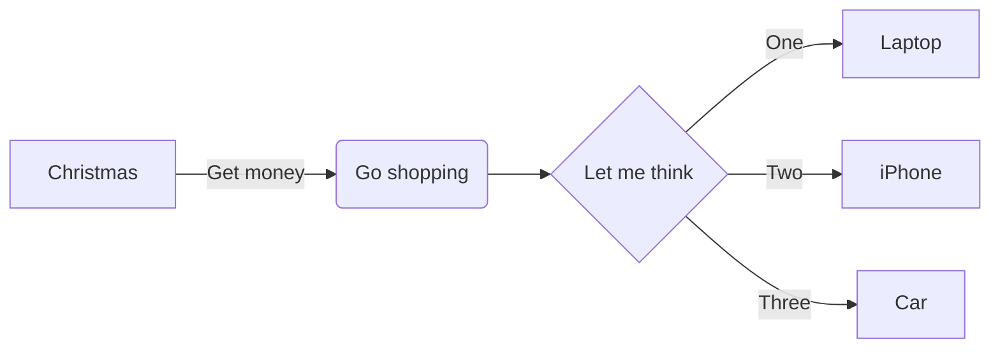

欢迎来到我的博客！

- GitHub: [https://github.com/sherlocknieh](https://github.com/sherlocknieh)

- 简历: [https://sherlocknieh.github.io/resume](https://sherlocknieh.github.io/resume)

mermaid 测试:

LaTeX 测试:

单行公式:  $ e^{i\pi} + 1 = 0 $

单行公式:  \\( e^{i\pi} + 1 = 0 \\)

多行公式:

$$
\begin{aligned}
\dot{x} & = \sigma(y-x) \\
\dot{y} & = \rho x - y - xz \\
\dot{z} & = -\beta z + xy
\end{aligned}
$$

<!-- 引入 MathJax -->

